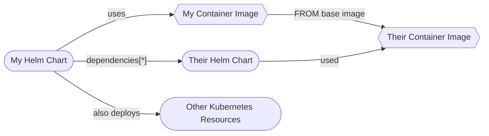
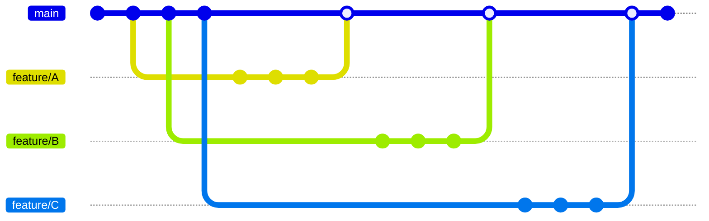
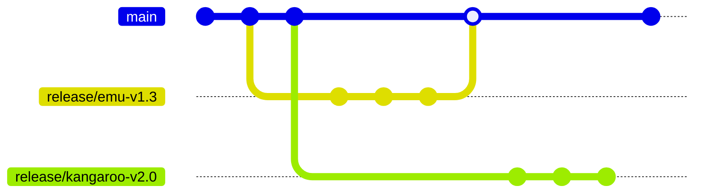
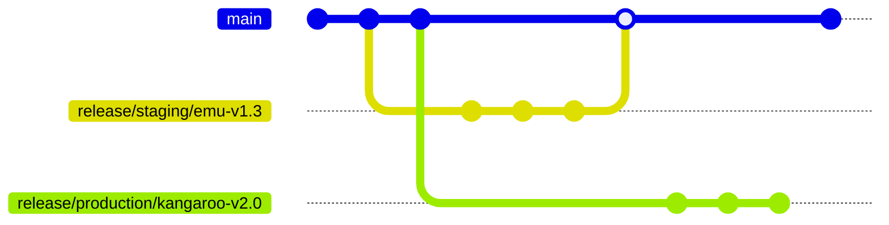

# How I Would Deploy Anything On Kubernetes

In this document, I will do my best to set down my shallow and imprecise opinions on the matter of deploying applications in Kubernetes. I will start from scratch, by taking the example of imaginary HTTP webservers, and detail the full structure of the Git repositories and the folder trees inside them. I will make my best to take into account source code, containerization, deployment, branching models, release management, versioning of deliverables, what is deployed where, finding what happened when something breaks, applications with sub-components, applications without sources, mono-repos and how it balances with pipeline complexity, scaling to more clusters, and to more applications.

This document is licensed under [CC BY-NC-SA 4.0](http://creativecommons.org/licenses/by-nc-sa/4.0/).


## Applications

To start with, I will make up applications: Wombat, Emu, Kangaroo and Platypus. All of them are imaginary, and I imagine them as webapps, that is: programs that spend their lives listening to a network socket for connections, and responding to HTTP(S) requests by HTTP(S) responses.

For each application, I will create one application Git repository, [I will expand on mono-repos later on](#containers-and-charts-mono-repos). Each application repo contains the source code of the application, a [Dockerfile](https://docs.docker.com/engine/reference/builder/) for building container images, a [Helm chart](https://helm.sh/) to deploy the application [on the Kubernetes clusters I will make up later](#clusters), and a Jenkinsfile for automation. All applications here are the same, I will show the folder tree for just one application repo in order to keep things shorter.

```plaintext
Applications
  🦊 Wombat
  🦊 Emu
  🦊 Kangaroo
  🦊 Platypus
    📁 Sources
      📁 **
        📄 *.{cs,fs,java,kt,py,go,rs} ◄── 1️⃣
    📁 Containers
      🐳 Containerfile ◄── 2️⃣
    📁 Charts
      📦 platypus
        📁 templates
          📄 deployment.yaml
          📄 service.yaml
          📄 service-account.yaml
        📄 Chart.yaml
        📄 values.yaml ◄── 3️⃣
    🔧 Jenkinsfile ◄── 4️⃣
```

Things to consider:

1. Which language(s), librariy(es) and framework(s) you use for developping the applications don't matter at all. The containerization and deployment will differ from one tech stack to another, by that I mean the base image will surely differ, each framework will have expectations regarding the location of the its config files on the file system and environment variables, and will have different capabilities for hot-reloading the configuration without restarting if needs be.

2. Which tool(s) you use to build your container images, be it [Docker](https://docs.docker.com/get-started/overview/), [Podman](https://docs.podman.io/en/latest/), [NerdCTL](https://github.com/containerd/nerdctl), [Kaniko](https://github.com/GoogleContainerTools/kaniko) or anything else, don't matter much either.

3. [Helm VS Kustomize](https://www.youtube.com/watch?v=ZMFYSm0ldQ0&themeRefresh=1)? Here it goes again: this matters as much as a bar fight matters to the world.

   * Raw YAML has the benefit of being the simplest, but will lack refactoring capabilities that go beyond [YAML](https://www.educative.io/blog/advanced-yaml-syntax-cheatsheet#anchors) [anchors](https://medium.com/@kinghuang/docker-compose-anchors-aliases-extensions-a1e4105d70bd). If your copy-pasting activities are taking an ever larger part of your time table, you should consider upgrading. One red flag that signals the limit of raw YAML is having one big YAML file for all the resources, and abusing YAML anchors to prevent repetitions. Another potential red flag is using a separate tool to statically generate the YAML.

   * [Kustomize](https://kubectl.docs.kubernetes.io/guides/introduction/kustomize/) works by defining base Kubernetes resources on one side, and overlays for those same resources on the other side. At deploy-time, the overlays form layers that are merged into each other in the configured order. [Kustomize works well for this use case](https://www.densify.com/kubernetes-tools/kustomize/), but lacks the ability to loop over a given list and generate N resources from configuration, or is quite verbose when it comes these advanced modifications. I haven't used it much.

   * [Helm is a template engine](https://helm.sh/docs/chart_template_guide/data_types/). It's like PHP, old PHP without OOP, and you have to open and close the tags on each line, and the indentation of the output matters. On top of that, the user-defined functions, called [Named Templates or Partials](https://helm.sh/docs/chart_template_guide/named_templates/), take only one argument and [can only return strings](https://itnext.io/use-named-templates-like-functions-in-helm-charts-641fbcec38da#67d1). As a software developer by training, the template engine nature of Helm feels the most natural to me, despite the flaws I just highlighted. The pros and cons of Helm and Kustomize almost perfectly mirror. Helm lacks the overlaying bit of Kustomize: it is impossible to modify a resource once it's been output from a template file. The solution is to make your template ultra flexile, and anticipate by having as many configurable blanks to fill, which leads to the well known [template soup](https://news.ycombinator.com/item?id=32624138#:~:text=Without%20you%20adding%20dozens%20of%20lines%20of%20values.yaml%20and%20golang%20template%20soup%20to%20a%20helm%20chart%20to%20allow%20every%20possible%20configuration%20a%20user%20might%20want%20(and%20never%20quite%20the%20same%20way%20in%20two%20different%20helm%20charts%20from%202%20different%20people).) red flag. A Helm chart is only as powerful as its templates are flexible.

     In the rest of this document, I will be using Helm, as this is the tool I master best.

   * [Carvel ytt](https://www.youtube.com/watch?v=DLnXkH2keNg), [kpt](https://www.youtube.com/watch?v=Wavigyq7NdQ), [Timoni, CUE](https://www.youtube.com/watch?v=bbE1BFCs548)... At this point, I would advise throwing a fully fledged programming language at the problem and making your own tool. Use [Typescript](https://www.typescriptlang.org/docs/handbook/typescript-from-scratch.html) with [Bun](https://bun.sh/docs), get built-in support from VS Code, containerize it into an [Argo CD Content Management Plugin](https://argo-cd.readthedocs.io/en/release-2.9/operator-manual/config-management-plugins/), use JS Modules and `export function` to return the Kubernetes resources as objects, gather them into an array, use `for` loops to mimic the feature of Kustomize to overlay the non-configurable values, serialize to JSON or YAML.

   The really important takeaway here is that the chart only has the default `values.yaml` file. It does not define more values files for each cluster or each environment the application will be deployed to. The application Helm chart remains unaware of its deployment sites, values files will be provided by a different source.

4. [Argo Workflows](https://argoproj.github.io/argo-workflows/), [Azure DevOps Pipelines](https://learn.microsoft.com/en-us/azure/devops/pipelines/get-started/what-is-azure-pipelines?view=azure-devops), [Jenkins](https://www.jenkins.io/doc/) or any other pipeline executor(s) that can be triggered on push to a Git or artifact will do, it doesn't matter.

The job of the pipeline in each appplication repo is to produce deployable deliverables. Namely, it should build the application into a `*.dll`, `*.jar` or whatever artifact applies to the chosen tech stack, run the unit tests, build the container image from the built artifact and push it to a container registry, update the Helm chart's default `values.yaml` to use this container image, [package](https://helm.sh/docs/helm/helm_package/) it, and push the resulting `*.tgz` to a Helm repository.

This whole sub-process takes place on the application side. It is entirely self-contained, and does not require knowledge of where the applications will be deployed to. It also heavily relies on you, or an automated process, being disciplined enough to [version the 💩 out of everything](https://semver.org/spec/v2.0.0.html), from application source code, to container images, to packaged Helm charts, and cascade the version number increments correctly, according to your chosen versioning scheme!


## Clusters

To deploy my imaginary applications, I will make up some Kubernetes clusters: Production, Staging and Rolling. Production is obviously live and available from the Internets for use by the general public, while Staging and Rolling are internal and used for testing. The difference is that you would deploy to Staging when rehearsing before deploying to Production, and you would deploy to Rolling much more often, possibly on an automated basis, for asserting that the applications and their configurations go well together.

For each cluster, I will create one cluster Git repository, [I will expand on mono-repos later on](#clusters-mono-repo). Each cluster repo contains the list of which versions of the applications are to be deployed in the corresponding live cluster, as well as any additional configurations, all in the form of Kubernetes resources, and organized by namespaces and resource types. All clusters here are the same, I will show the folder tree for just one cluster repo in order to keep things shorter.

```plaintext
Applications
  🦊 Wombat
  🦊 Emu
  🦊 Kangaroo
  🦊 Platypus

Clusters
  🦊 Production
  🦊 Staging
  🦊 Rolling
    📁 namespaces
      📁 argo-cd
        📁 argoproj.io.Applications ◄── 1️⃣
          📜 rolling-cluster.yaml
          📜 argo-cd.yaml
          📜 wombat.yaml
          📜 emu.yaml
          📜 kangaroo.yaml
          📜 platypus.yaml
      📁 wildlife ◄── 2️⃣
        📁 bitnami.com.SealedSecret
          📄 emu-omelet.yaml
          📄 kangaroo-pocket.yaml
        📁 networking.k8s.io.Ingresses
          📄 wombat.yaml
          📄 emu.yaml
          📄 kangaroo.yaml
          📄 platypus.yaml
```

Things to consider:

1. Which GitOps agent you install doesn't matter. [OCP ACM](https://www.redhat.com/en/technologies/management/advanced-cluster-management), [Argo CD](https://argo-cd.readthedocs.io/en/stable/) and [Flux CD](https://fluxcd.io/flux/) all seem to be well established industry standards. Any tool that works on a Kubernetes custom resource to determine what version of an application chart to deploy in what cluster will do.

   In this document, I will be using Argo CD, as I have the most experience with it.

2. Additional resources include anything that isn't defined in the application Helm charts, such as secrets, container runtime configuration, some people choose not to make ingresses part of their charts because they draw a hard line between applications and routing, some do the same for network policies, and the extremists even extract config-maps out of their charts! In the end, what really matters is minimizing the fear of changes and the strain of maintenance, and keeping together the resources that are tightly coupled, not the means put in place to make this happen.

To bootstrap such a cluster, you would first install an Argo CD instance on it, this can be done by templating the official Helm chart, then you would apply the [app of apps](https://argo-cd.readthedocs.io/en/release-2.9/operator-manual/cluster-bootstrapping/#app-of-apps-pattern) from `namespaces/argo-cd/argoproj.io.Applications/*-cluster.yaml`. This automates everything else, as the app of apps references the `namespaces` folder of its own repository, which contains the app of apps itself, the `argo-cd.yaml` Argo app, which makes Argo CD deploy and maintain itself, all the other Argo apps, each of which references a specific version of the corresponding application chart, and all the other ad-hoc Kubernetes resources defined there!

```plaintext
🦊 Rolling
  📁 namespaces
  ▲ 📁 argo-cd
  │   📁 argoproj.io.Applications
  │     📄 rolling-cluster.yaml
  │       | spec:
  │       |   source:
  │       |     repoURL: https://example.com/git/clusters/rolling.git
  └────── |     path: namespaces
          |     targetRevision: main
        📄 argo-cd.yaml
          | spec:
          |   source:
          |     repoURL: https://example.com/helm
          |     chart: argo-cd # Imaginary mirror of the official chart.
          |     targetRevision: 1.2.3
        📄 *.yaml
    📁 **
      📄 *.yaml
```


## Deploying

In this section, I will detail the process of making changes, from the source code of the application, containerfile, deployment chart or configuration, to actual deployment in a cluster. I will consider that a change starts from pushing a commit to the `main` branch of an application Git repository, I will explore [more sophisticated branching models later](#branching-models).

1. When changing the source code of the application, containerfile or Helm chart, whichever Jenkins, ADO or any other pipeline executor is triggered by the push of new commit(s) to the `main` branch. The pipeline rebuilds not only the application artifact(s), but also the container image(s) and the chart(s)! Alternatively, if building the application binaries or the container image is particularly long, the pipeline can compute whether or not these components have changed, and reuse existing artifacts or images appropriately, but making the pipeline more intelligent may come at the cost of increasing its complexity.

   The pipeline [can](#versioning-discipline) update and cascade the versions of the aforementioned deliverables automatically, [by inspecting the commit messages](https://medium.com/agoda-engineering/automating-versioning-and-releases-using-semantic-release-6ed355ede742), or use static values provided from the configuration files of the project. The pipeline always publishes new versions of the packaged Helm chart, remember your oath to version the 💩 out of everything!

2. Another pipeline is triggered by the push of the new version of the packaged chart to the Helm repository. It checks out the Git repo of the Rolling cluster, and updates the `.spec.source.targetRevision` of the appropriate Argo app accordingly.

   This deployment pipeline is separate from the build pipeline that lives in the application repo. I can be defined either in the cluster Git repository, or in an entirely separate repo:

   ```plaintext
   🦊 Automation
     📁 Pipelines
       🔧 Jenkinsfile.auto-deploy-to-rolling
   ```

   The pipeline commits and pushes to the `main` branch of the cluster repo.

3. The GitOps agent installed in the cluster is triggered by the push of the new commit to the `main` branch of the cluster repo, and applies the desired state defined in its source of truth, the cluster repo, to the cluster. The changes take effect, deployments are modified, pods are terminated and restarted, etc...

Updating the deployed configuration takes a shorter path, since there is no need to rebuild any of the application binaries, container images or Helm charts. Those should not contain any deployment-specific configuration in the first place.

1. You change the values of a config-map, secret or a chart values file, directly in the cluster repo, commit on the `main` branch, and push.

2. The GitOps agent installed in the cluster is triggered by the push, and applies the desired state from Git to the cluster. The changes take effect immediately... There may be a need for restarting pods when a config-map is changed, [this is a capability of the Helm chart](https://helm.sh/docs/howto/charts_tips_and_tricks/#automatically-roll-deployments) that must be actively used to be enabled.

Promoting a new version of an application (chart) to the Staging and Production clusters works the same way as for Rolling. The process can be automated, but I want a deployment to Production to be a conscious action for the sake of the example. In this case, it isn't a pipeline, but a human operator who updates the `.spec.source.targetRevision` of the appropriate Argo app in te appropriate cluster repo. The GitOps agent installed in the cluster will be triggered by the push of the new commit(s) and do its usual magic.

The strict versioning of everything was worth it: promoting a new version of an application (chart) from cluster to cluster is just about updating a version number!

It is worth to consider that promotion doesn't apply to the application artifact(s), nor to the container image(s), these would be red flags, but rather to the entire Helm chart. The rationale behind this revolves around expectation fulfilment: the containerized application has expectations regarding its file system, environment variables, and access to external webservices. The chart packages Kubernetes resources that transform these expectations into volumes, services, and blanks in the templates to be filled by volume mounts and other ad-hoc values provided by the specific configuration for each cluster. I don't want to be the person fulfilling the new expectations of a new container image by using the old resources of an old chart.


## Glossary

> This independent section builds on top of the original structure of Git repositories, folder tree and process presented above. From this base, it details particular points, explores an alternative structure, or incorporates extra constraints.

In this section, I will list a couple a terms that I think might bring confusion. Application, repository and cluster are perfect example of such polysemous vocabulary. The objective is certainly far from even the start of a comprehensive [ubiquitous language](https://en.wikipedia.org/wiki/Domain-driven_design#Overview), rather, this glossary is for everyone to understand each other, it associates specific words to specific meanings, and aims at preventing misunderstandings and periphrases. I will do my best to use these terms consistently in the rest of this document.

TL;DR: don't confuse the application, its Helm chart, and the Argo app.

* In this document, an `App[lication]` is an HTTP webserver: it listens the HTTP(S) requests and spends its live responding to them.

* Applications are defined by their `App[lication] [Source] Code`, written in any programming language, using any libraries and frameworks.

* An `[Application] {Artifact|Binary}` is the product of compiling the source code of an application. Typical examples are the `*.dll` of .NET, or the `*.{jar|war}` of Java.

* Artifacts are pushed to an `Artifact {Repo[sitory]|Registry}`, which stores them in an organized fashion. Examples are [NuGet.org](https://www.nuget.org/), [Maven Central](https://central.sonatype.com/), [NPM](https://www.npmjs.com/), or [JFrog Artifactory](https://jfrog.com/artifactory/).

* The application source code is stored and versioned in an `App[lication] [Git] Repo[sitory]`.

* If a process is a running instance of a program, then a `Container` is a running instance of a container image.

* A `{Container|Docker}file` is basically the source code for building a `[Container] Image`.

* Container images are pushed to a `Container Registry`, which stores them in an organized fashion. Examples are the [Docker Hub](https://hub.docker.com/), or the [GitHub Container Registry](https://github.blog/2020-09-01-introducing-github-container-registry/).

* An `[App[lication]] {Deployment Package|[Deployment] [Helm] Chart}` contains, or can be used to generate, all the Kubernetes resources necessary to deploy a containerized application in a Kubernetes cluster.

* An `Umbrella [Helm] Chart` is a hollow shell merely referencing other application Helm charts. Such a meta-package helps keeping specific versions of other application charts together.

* A `Packaged [Helm] Chart` is the product of packaging the templates and metadata of a Helm chart into a portable `*.tgz` archive.

* Packaged Helm charts are pushed to a `Helm Repo[sitory]`, which stores them in an organized fashion. An example is the [Artifact Hub] (https://artifacthub.io/).

* A `GitOps Agent` is a special containerized application running inside a Kubernetes cluster. It observes a set of sources and automatically synchronizes the Kubernetes resources of the cluster to match the desired state defined in those sources. Examples are [Argo CD](https://argo-cd.readthedocs.io/en/stable/), or [Flux CD](https://fluxcd.io/flux/).

* An `Argo [CD] App[lication]` is a Kubernetes custom resource that defines what sources a GitOps agent should use to deploy an application (chart) in the
Kubernetes cluster it's running in. This custom resource has one job: define what is deployed where! Another example is [the Flux CD's HelmRelease](https://fluxcd.io/flux/guides/helmreleases/#define-a-helm-release).

* A `Cluster [Git] Repo[sitory]` stores and versions the resources to be deployed in the cluster, serving as a source for Argo apps.


## Versioning Discipline

> This independent section builds on top of the original structure of Git repositories, folder tree and process presented above. From this base, it details particular points, explores an alternative structure, or incorporates extra constraints.

As glorious as it look, the deployment model I have presented relies heavily on the strict [versioning](https://en.wikipedia.org/wiki/Software_versioning#Schemes) of the application code, container images, and Helm charts. Humans are not disciplined, this raises multiple problems, which in turn have easier or harder solutions:

* It's easy to shoot yourself in the foot, and forget to update the version number of this or that component.
* Where to define the version of each component in the first place?
* Which entity is responsible for incementing and cascading the versions?
* When are the versions updated?

Essentially, these boil down to 3 questions: about where, when, and who.


### Who

If humans are put in charge of incementing and cascading the version numbers, they might forget to do so, leading to multiple container images or Helm charts having the same version.

If the pipeline is in charge, it will probably end up [inspecting the commit messages](https://medium.com/agoda-engineering/automating-versioning-and-releases-using-semantic-release-6ed355ede742) to compute which version numbers must be updated, and the appropriate way to increment them... The same commit messages that were poorly written by humans, leading to artifacts being pushed with misleading version numbers.

One possible safeguard against this is to configure your artifact repositories to strictly deny pushing the same artifact with the same version number. The pipeline will fail fast with a lot of pixels turning red on your screen, but at least the honor of the versioning scheme will be safe.

Another safeguard is having the build pipeline, or commit hooks, check for version updates. This way, the pipeline will straight up refuse to build or push anything if it doesn't detect a version update since thte last release, red pixels everywhere, but again, it's for the best.


### Where

While actually building, the application build pipeline needs to know where to look for the version numbers of the application binary, container image and Helm chart.

Setting aside the moment and means for incrementing these versions:

* The version of the application code is generally found in the project manifest file or equivalent. Whether this is a `*.pom`, a `*.csproj` or a `*.toml` file depends on your tech stack.

* The version of the container image, if not the same as the application's, can be stored in a separate file that will be read by the pipeline.

* The version of the Helm chart is easily found in its `Chart.yaml`.


### When

I thought releasing a new version could be triggered by any push to the `main` branch of the application repo. If there are too many pushes to `main`, it should be possible restrain the releases to trigger only on tagged commits, or only when commits are pushed to `release/*` specific branches. The section about [branching models](#branching-models) will provide much more details.


## What Is Deployed Where?

> This independent section builds on top of the original structure of Git repositories, folder tree and process presented above. From this base, it details particular points, explores an alternative structure, or incorporates extra constraints.

The Argo apps are all stored and versioned in the cluster repositories, each of them is a Kubernetes resource that defines precisely what version of an application chart is deployed in the cluster. From this premise, generating a table of all the applications and their versions that are deployed across all clusters is easy and doesn't even necessitate any tooling more advanced than shell scripting.

```plaintext
🦊 Production
  📁 namespaces
    📁 argo-cd
      📁 argoproj.io.Applications
        📜 wombat.yaml   ◄── The
        📜 emu.yaml      ◄── only
        📜 kangaroo.yaml ◄── source
        📜 platypus.yaml ◄── of truth
        📜 *.yaml
```

The Argo apps, like any respectable Kubernetes resource, has a `.status` field that can be monitored normally. The creation of a live dashboard crossing the applications and the clusters, with versions and statuses, is clearly out of the scope of this document...


## Something Broke, What Happened?

> This independent section builds on top of the original structure of Git repositories, folder tree and process presented above. From this base, it details particular points, explores an alternative structure, or incorporates extra constraints.

Deploying applications only signs you in for the rest of their maintenance and operation lifecycle. Monitoring and alerting are out of scope for this document, which focuses solely on the deployment path. However, with correct monitoring, you will be able to trace the appearance of problems to a point in time and space, space being a cluster in this case, and use the versioning capabilities of Git to get which Argo apps or configurations were updated just prior.

Having strict and consistent versioning is crusial to make the experience less unpleasant. Separating each cluster in its own repository limits the flood of Git commits to analyse.


## Where Are The Charts Values?

> This independent section builds on top of the original structure of Git repositories, folder tree and process presented above. From this base, it details particular points, explores an alternative structure, or incorporates extra constraints.

On the Inernets, it has become quite usual to see Helm charts for a given application containing not only the default `values.yaml` files, but also a plethora of values files for each of the clusters the application is to be deployed to. To me, this violates the principle according to which an application Helm chart is an environment-agnostic deliverable that could be used to deploy the application anywhere. This is why I haven't created any other values files in the applications repositories.

Instead, the values for each chart deployment should be provided at deploy-time, and therefore declared as close as possible to the other deployment resources. This makes the Argo apps the perfect place for the job. The simplest option is for them to supply values from their `.spec.source.helm.valuesObject`, which acts as an inline values file. This works well enough for what would be small-size values files. Alternatively, Argo apps can reference separate values files from their `.spec.sources[*].helm.valueFiles`. They can [reference multiple sources](https://argo-cd.readthedocs.io/en/release-2.9/user-guide/multiple_sources/#helm-value-files-from-external-git-repository) and supply a versioned chart from a Helm repository, a first source, with values files from their own cluster repository, a second source.

```plaintext
🦊 Rolling
  📁 namespaces
    📁 argo-cd
      📁 argoproj.io.Applications
        📄 *.yaml
        📄 emu.yaml
          | spec:
          |   sources:
          |     - repoURL: https://example.com/helm
          |       chart: emu
          |       targetRevision: 1.2.3
          |       helm:
          |         valueFiles:
          |           - $values/emu.yaml # This `$values` corresponds to the `ref: values` below.
          |     - ref: values
          |       repoURL: https://example.com/git/clusters/rolling.git
  ┌────── |       path: values
  │       |       targetRevision: main
  │ 📁 **
  ▼   📄 *.yaml
  📁 values
    📄 emu.yaml
```


## Applications Without Source Code

> This independent section builds on top of the original structure of Git repositories, folder tree and process presented above. From this base, it details particular points, explores an alternative structure, or incorporates extra constraints.

Whether because you lack involvement from the app developers or because you are deploying applications that are made by others, you will sometimes not have access to the source code of the applications you are deploying, nor to their build pipelines. In both cases, you will have to consider them as external applications and treat them appropriately.

An application can be external at different levels, depending on which deliverables are made pubicly available.

* If the developers publish the binaries for their application, your own build pipeline will have to be triggered by some kind of webhook or other event that happens whenever new versions of the artifacts are pushed to an external repository. From there, the pipeline can build the container image and the Helm chart normally.

* If the developers publish container images, your pipleline can be triggered by the events fired by an external container registry, and package the Helm chart normally. If you don't like the stock container image, you can make your own image by using the stock image as a [base](https://docs.docker.com/engine/reference/builder/#from). In this case, a pipeline can update the version of the base image, or a human can consciously do it.

* If the developers publish a Helm chart, you can point an Argo app to their external Helm repository directly, which is what I have been doing for Argo CD itself, or extend the stock chart by wrapping it with an umbrella chart. Similar to the container image, either an automated pipeline or a human can update the version of the dependency chart.

Using both the stock container image as a base and the stock chart as a dependencies, you can end up with two pairs of contaimer image & Helm chart for one application.




## Applications With Multiple Components

> This independent section builds on top of the original structure of Git repositories, folder tree and process presented above. From this base, it details particular points, explores an alternative structure, or incorporates extra constraints.

Up until now, my imaginary applications have consisted in a single HTTP API each. In this section I will explore splitting the Platypus application into 3 webservices: Duck, Bear and Beaver. This is far from some interconnected krakens seen in the wild, but good enough for the example.

The easiest option for separating the sub-components is to keep splitting the application repo into source, containers and charts first, then splits again into each component. This leaves one Helm chart that will generate the Kubernetes resources for the all the sub-components.

```plaintext
🦊 Platypus
  📁 Sources
    📁 Duck
      📁 **
        📄 *.{cs,fs,java,kt,py,go,rs}
    📁 Bear
      📁 **
        📄 *.{cs,fs,java,kt,py,go,rs}
    📁 Beaver
      📁 **
        📄 *.{cs,fs,java,kt,py,go,rs}
  📁 Containers
    🐳 Containerfile.duck
    🐳 Containerfile.bear
    🐳 Containerfile.beaver
  📁 Charts
    📦 platypus
      📁 templates
        📁 duck
          📄 *.yaml
        📁 bear
          📄 *.yaml
        📁 beaver
          📄 *.yaml
      📄 Chart.yaml
      📄 values.yaml
  🔧 Jenkinsfile
```

The major issue of this setup is that there are now 3 sub-components for a single pipeline, which must now build 3 applications, 3 container images, and 1 Helm chart. This means building all sub-components everytime, or increase the complexity of the pipeline to differentiate the sub-components that have been changed from those that can be reused from previous releases. There is only one Helm chart, which makes for a single `Chart.yaml` file with a single `.appVersion` field, and the Cornelian choice of which version to pick, unless the sub-components share the same version number. Having the same version for all the sub-components and systematically building them together makes the most sense here, especially if they are supposed to be tightly coupled.

The next evolution is to split the Helm chart into 4: one for each sub-component, and one umbrella chart referencing the sub-components using the Helm dependency mechanism. Alternatively, the component charts can be put directly in `Charts/platypus/charts`.

```plaintext
🦊 Platypus
  📁 Sources
  📁 Containers
  📁 Charts
┌─► 📦 duck
│     📁 templates
│       📄 *.yaml
│     📄 Chart.yaml
│     📄 values.yaml
├─► 📦 bear
│     📁 templates
│       📄 *.yaml
│     📄 Chart.yaml
│     📄 values.yaml
├─► 📦 beaver
│     📁 templates
│       📄 *.yaml
│     📄 Chart.yaml
│     📄 values.yaml
│   📦 platypus
└──── 📄 Chart.yaml
  🔧 Jenkinsfile
```

Only packaging the umbrella chart is necessary: the dependency charts will be inlined in the `charts` sub-folder inside the `*.tgz` archive.

The final form of the split puts each sub-component in its own application repository, each containing its own source code, containerfile, Helm chart and build pipeline, functioning independently. The Platypus application repository now doesn't hold any source code nor containerfile anymore, and consists solely of an umbrella chart and the pipeline to package it, triggered by the push of  new version of one of its dependencies to the Helm repository.

```plaintext
🦊 Duck
🦊 Bear
🦊 Beaver
▲ 📁 Sources
│   📁 **
│     📄 *.{cs,fs,java,kt,py,go,rs}
│ 📁 Containers
│   🐳 Containerfile
│ 📁 Charts
├─► 📦 beaver
│     📁 templates
│       📄 *.yaml
│     📄 Chart.yaml
│     📄 values.yaml
│ 🔧 Jenkinsfile
│
│ 🦊 Platypus
│   📁 Charts
│     📦 platypus
└────── 📄 Chart.yaml
    🔧 Jenkinsfile
```

This is the best setup for applications with sub-components developped independently against different release cycles. The umbrella chart barely synchronizes the versionsof all components.


## Scaling To More Applications

> This independent section builds on top of the original structure of Git repositories, folder tree and process presented above. From this base, it details particular points, explores an alternative structure, or incorporates extra constraints.

Adding more applications to the base infrastructure consists in adding a new application repository, containing the usual source code, containerfiles, Helm charts and build pipeline. Deploying the new application to any cluster consists in adding a new Argo app resource to the appropriate cluster(s).


## Scaling To More Clusters

> This independent section builds on top of the original structure of Git repositories, folder tree and process presented above. From this base, it details particular points, explores an alternative structure, or incorporates extra constraints.
>
> Prerequisite: [Where Are The Charts Values?](#where-are-the-charts-values)

In this section, I will add another production cluster for redundancy. I will explore some techniques that can be used to reduce repetition across the two clusters. I will skip the simplest scenario consisting of two perfectly identical clusters, in which case the same cluster repo can be used as a source of truth for both of them.

At the extreme opposite, the two production clusters would have all their configuration duplicated. Each cluster repo would be independent, this means a lot of duplication to define the Argo apps and the other Kubernetes resources, and more maintenance effort to synchronize the versions and the configuration in both clusters. Having two indenpendent clusters can allow for a two-phase release of new application (chart) versions, where one cluster is being upgraded while the other is taken out of the load balancing system. While this solution can bring some feeling of safety, it looks like nothing but a poor parody, and may only slow you down in the adoption of any proper rollout strategy brought by Kubernetes Deployments or Argo Rollouts.

Solutions sitting in the middle will involve using a common cluster repository to hold the common Argo apps and other resources. Below, I will take an example using Argo apps and ingresses common to both clusters, but secrets imagined to have different values for each cluster. The two clusters will be soberly named Production 1 and Production 2, their respective cluster Git repos contain only the secrets, and each of their `production-*-cluster.yaml` app of apps uses multiple sources to reference not only their own cluster repo, but also the new Production Common repo. Production Common is a Git repository that contains all the common resources: the Argo apps, except the app of apps for each cluster, and the ingresses. Values for the charts referenced by the common Argo apps are imagined common, I will come back to them shortly. The cluster repos for Production 1 and Production 2 are the same, I will only show one for brievety.

```diff
  Clusters
    🦊 Production Common
  ┌─► 📁 namespaces
  │     📁 argo-cd
  │       📁 argoproj.io.Applications
> │         📜 argo-cd.yaml
> │         📜 wombat.yaml
> │         📜 emu.yaml
> │         📜 kangaroo.yaml
> │         📜 platypus.yaml
  │     📁 wildlife
  │       📁 networking.k8s.io.Ingresses
> │         📄 wombat.yaml
> │         📄 emu.yaml
> │         📄 kangaroo.yaml
> │         📄 platypus.yaml
  │ 🦊 Production 1
  │ 🦊 Production 2
  │   📁 namespaces
  │   ▲ 📁 argo-cd
  │   │   📁 argoproj.io.Applications
  │   │     📜 production-2-cluster.yaml
  │   │       | spec:
  │   │       |   sources:
  │   │       |     - repoURL: https://example.com/git/clusters/production-2.git
  │   └────── |       path: namespaces
  │           |       targetRevision: main
  │           |     - repoURL: https://example.com/git/clusters/production-common.git
  └────────── |       path: namespaces
              |       targetRevision: main
<           📜 argo-cd.yaml
<           📜 wombat.yaml
<           📜 emu.yaml
<           📜 kangaroo.yaml
<           📜 platypus.yaml
        📁 wildlife
          📁 bitnami.com.SealedSecret
            📄 emu-omelet.yaml
            📄 kangaroo-pocket.yaml
<         📁 networking.k8s.io.Ingresses
<           📄 wombat.yaml
<           📄 emu.yaml
<           📄 kangaroo.yaml
<           📄 platypus.yaml
```

If some cluster-specific values must be supplied to the common appliction Helm charts, the values files can be stored in the respective cluster repos. In the common repository, the Argo apps can be declared in a Git-hosted Helm chart, rather that from raw YAML manifests, to allow for their configuration to be templated. Their ability to declare multiple sources can be used to reference an versioned application Helm chart in a Helm repository, and a values file left to be templated.

```diff
  Clusters
    🦊 Production Common
      📁 charts
 ┌────► 📦 applications
 │        📁 templates
 │          📜 argo-cd.yaml
 │          📜 wombat.yaml
 │          📜 emu.yaml
 │          📜 kangaroo.yaml
 │          📜 platypus.yaml
 │            | spec:
 │            |   sources:
 │            |     - repoURL: https://example.com/helm ◄── 1️⃣
 │            |       chart: platypus
 │            |       targetRevision: 1.2.3
 │            |       helm:
 │            |         valueFiles:
 │            |           - $values/platypus.yaml
 │            |     - ref: values
 │            |       repoURL: https://example.com/git/clusters/{{ $.Values.valuesFilesRepo }}.git ◄── 2️⃣
┌│─────────── |       path: values
││            |       targetRevision: main
││        📄 Chart.yaml
││┌─► 📁 namespaces
│││     📁 **
│││       📄 *.yaml
│││ 🦊 Production 1
│││ 🦊 Production 2
│││   📁 namespaces
│││   ▲ 📁 argo-cd
│││   │   📁 argoproj.io.Applications
│││   │     📜 production-2-cluster.yaml
│││   │       | spec:
│││   │       |   sources:
│││   │       |     - repoURL: https://example.com/git/clusters/production-2.git ◄── 3️⃣
│││   └────── |       path: namespaces
│││           |       targetRevision: main
│││           |     - repoURL: https://example.com/git/clusters/production-common.git ◄── 4️⃣
││└────────── |       path: namespaces
││            |       targetRevision: main
││            |     - repoURL: https://example.com/git/clusters/production-common.git ◄── 5️⃣
│└─────────── |       path: charts/applications
│             |       targetRevision: main
│             |       helm:
│             |         valuesObject:
│             |           valuesFilesRepo: production-2
│       📁 **
│         📄 *.yaml
└───► 📁 values
        📄 platypus.yaml
```

Things to consider:

1. The Production Common repository doesn't contain the raw manifests of the Argo apps for each application (chart) to deploy, rather, they are moved in a Helm chart that will generate them at deploy-time. The Argo apps reference the versioned Helm chart as a source, as usual.

2. Don't forget that these Argo app resources are not raw YAML manifests anymore, they are now templated! The templating syntax of Helm can be used to inject the name of the repository that will provide the values files for the application chart.

3. The App of apps in each production cluster repo references the raw resources from its own cluster repository, as usual. In this imaginary scenario, this will deploy the cluster-specific secrets.

4. The App of apps in each production cluster repo also references the raw resources from the Production Common repository, as before.In this example, this will deploy the common ingresses.

5. Finally, the App of apps in each production cluster references the Git-hoster Helm chart, which generates the other Argo apps, from the Production Common repo, and provides configuration values to indicate its own repository as the source for the application chart values files. Doing so will reference the production cluster repo as the source for values files for the applications deployed in this cluster.

You can reach various levels of templating depending how much of your common resources you put in the common Helm chart, and how much you declare as raw YAML.


## Branching Models

> This independent section builds on top of the original structure of Git repositories, folder tree and process presented above. From this base, it details particular points, explores an alternative structure, or incorporates extra constraints.

In this section, I will explain the details of the Git branching models I would use for both the application repositories and the cluster repositories. I will mainly focus on when new versions of the deliverables are released.


### For Applications

[Real [men] commit on the `main` branch](https://www.youtube.com/watch?v=hL1OZfgoZGk) directly. This is virile and removes the need for a branching model and the associated headaches altogether. The downside of this non-model appears when one developer gets stuck on a feature: they get stuck on `main`, there is no build anymore, they stick everybody else with them.

The conservative rest of the population will appreciate the ability to buffer changes on `feature/*` branches before merging them to the `main` branch.



When to build releases?

* A first option would be to have the application build pipeline release new versions of the binaries,container image(s) and Helm chart(s) for each push to the `main` branch.

  ```mermaid
  %%{
    init: {
      'gitGraph': {
        'showCommitLabel': false
      }
    }
  }%%
  gitGraph
    commit

    commit
    branch feature/A
      checkout main

    commit
    branch feature/B
      checkout main

    commit tag: "→ 1.2.3"
    branch feature/C
      checkout main

    checkout feature/A
      commit
      commit
      commit
      checkout main
      merge feature/A tag: "→ 1.3.0"

    checkout feature/B
      commit
      commit
      commit
      checkout main
      merge feature/B tag: "→ 2.0.0"

    checkout feature/C
      commit
      commit
      commit
      checkout main
      merge feature/C tag: "→ 2.0.1"

    commit
  ```

  This means that some effort must be made to keep the state of the `main` branch as stabe as possible, because whatever is in `main` is considered as potentially deployable to production. If the `main` branch doesn't systematically produce stable deliverables, the pressure is passed onto the pipeline, which has the heavy responsibility to fail fast and abort the release.

  To mitigate this while still considering the `main` branch as the sole source of publication, changes, which are already buffered on `feature/*` branches, can be buffered again on a `dev` branch before their final merge to `main`. In addition, merging to `dev` can trigger the build of preview or snapshot releases that can have a different lifecycle that production-ready releases.

  ```mermaid
  %%{
    init: {
      'gitGraph': {
        'showCommitLabel': false
      }
    }
  }%%
  gitGraph
    commit tag: "→ 1.2.3"

    branch dev
    commit

    commit
    branch feature/A
      checkout dev

    commit
    branch feature/B
      checkout dev

    commit
    branch feature/C
      checkout dev

    checkout feature/A
      commit
      commit
      commit
      checkout dev
      merge feature/A tag: "→ 1.3.0-preview1"

    checkout feature/B
      commit
      commit
      commit
      checkout dev
      merge feature/B tag: "→ 2.0.0-preview1"

    checkout main
      merge dev tag: "→ 2.0.0"

    checkout feature/C
      commit
      commit
      commit
      checkout dev
      merge feature/C tag: "→ 2.0.1-preview1"

    checkout main
      merge dev tag: "→ 2.0.1"

    commit
  ```

* Another option would be to release for each tagged commit pushed to the `main` branch. This way, there is more control on exactly when the build pipeline runs.

  ```mermaid
  %%{
    init: {
      'gitGraph': {
        'showCommitLabel': false
      }
    }
  }%%
  gitGraph
    commit

    commit
    branch feature/A
      checkout main

    commit
    branch feature/B
      checkout main

    commit tag: "v1.2.3 → 1.2.3"
    branch feature/C
      checkout main

    checkout feature/A
      commit
      commit
      commit
      checkout main
      merge feature/A tag: "→ no build"

    checkout feature/B
      commit
      commit
      commit
      checkout main
      merge feature/B tag: "→ no build"

    checkout feature/C
      commit
      commit
      commit
      checkout main
      merge feature/C tag: "v2.0.0 → 2.0.0"

    commit
  ```

* Yet another option is to release for each commit pushed to any `release/*` branch. Unlike the `feature/*` branches, which are temporary and destined to be merged, these `release/*` branches live forever, they are never merged back. This model is especially useful when supporting multiple versions of the same application in parallel, at destination of different customers.

  ```mermaid
  %%{
    init: {
      'gitGraph': {
        'showCommitLabel': false,
        'mainBranchOrder': 10
      }
    }
  }%%
  gitGraph
    commit

    commit
    branch feature/A order: 11
      checkout main

    commit
    branch feature/B order: 11
      checkout main

    commit
    branch feature/C order: 11
      checkout main

    checkout feature/A
      commit
      commit
      commit
      checkout main
      merge feature/A

    branch release/v1.3 order: 0
      commit tag: "→ 1.3.0"
      commit
      branch hotfix/A
        commit
        commit id: "cherry"
    checkout release/v1.3
      merge hotfix/A tag: "→ 1.3.1"
      commit

    checkout main
      cherry-pick id: "cherry" tag: ""

    checkout feature/B
      commit
      commit
      commit
      checkout main
      merge feature/B

    checkout feature/C
      commit
      commit
      commit
      checkout main
      merge feature/C

    branch release/v2.0 order: 1
      commit tag: "→ 2.0.0"
      commit
      branch hotfix/B order: 1
        commit
        commit
      checkout release/v2.0
      merge hotfix/B tag: "→ 2.0.1"
      commit

    checkout main
    commit
  ```

* Finally, there is the options of complexifying even things even more by releasing only on tagged commit pushed to any `release/*` branch... I think you get the picture...

The branching model for the application repository encompasses the source code, but also the containerfile and the chart code, as those three deliverables are tightly coupled. I will leave the headache of choosing which of the application artifact, container image or Helm chart should give its version number to the release tags and branches to the reader as an exercise.


### For Clusters

The branching model for the cluster repositories can be much simpler. After all, the Kubernetes resources defined in these repos are to be synchronized and deployed continuously to the cluster. In these conditions, there are no releases, no versions beyond the ones set by the Git commits, there is only one timeline, the timeline in which the clusters live in, our timeline, the `main` timeline.


At this point, you may make a change in the Rolling or Staging cluster and think you will need the same or a similar change in the Production cluster as well... But not now... But you will forget it if you delay the change... This situation calls for `release/*` branches. Don't be fooled by the naming: the `release/*` branches of the cluster repositories have nothing to do with the `release/*` branches of the application repositories. In fact, they are more alike their `feature/*` branches, in that they are here to buffer changes before getting merged to the `main` branch.



In cluster repositories, hotfixes can be implemented directly on the `main` branch. The GitOps agent will synchronize the changes automatically.


## Different Apps, Different Release Cycles

> This independent section builds on top of the original structure of Git repositories, folder tree and process presented above. From this base, it details particular points, explores an alternative structure, or incorporates extra constraints.

The base structure presented in this document is agnostic to changes freezes, and the deployment process is not tightly coupled to the release cycle of any specific application. Which applications are deployed in which clusters is determined entirely by the `.spec.source` of the Argo apps defined in each cluster repository. Deploying different applications on different release cycles simply means updating different files at different times, which shouldn't be so difficult.

```plaintext
🦊 Production
  📁 namespaces
    📁 argo-cd
      📁 argoproj.io.Applications
        📜 wombat.yaml   ◄── Consistently updated every SCRUM Sprint.
        📜 emu.yaml      ◄── Released when it's ready.
        📜 kangaroo.yaml ◄── One big release every 6 months.
        📜 platypus.yaml ◄── New release whenever any app above is released.
        📜 *.yaml
```


## One Argo CD Instance Per Cluster

> This independent section builds on top of the original structure of Git repositories, folder tree and process presented above. From this base, it details particular points, explores an alternative structure, or incorporates extra constraints.

I have made the assumption that each cluster would have its own GitOps agent installed inside it, but some teams will prefer to use a separate [management](https://akuity.io/blog/argo-cd-architectures-explained/) [cluster](https://codefresh.io/blog/a-comprehensive-overview-of-argo-cd-architectures-2023/) to host their GitOps agent, and make it deploy to the other, now remote, clusters. This is perfectly acceptable, but it requires moving a few files around. In this section, I will detail the changes to expect.

I will create a new Management cluster and its corresponding cluster repository, then move all the Argo apps from all cluster repos to Management. The Production, Staging and Rolling cluster repos are the same, I will show ony one to save space.

```diff
Clusters
  🦊 Management
    📁 namespaces
    ▲ 📁 argo-cd
    │   📁 argoproj.io.Applications ◄── 1️⃣
    │     📁 clusters
    │       🏭 management
    └──────── 📜 management-cluster.yaml
>             📜 argo-cd.yaml
            🏭 production
   ┌───────── 📜 production-cluster.yaml
   │          📜 *.yaml
   │        🏭 staging
   ┌───────── 📜 staging-cluster.yaml
   │          📜 *.yaml
>  │        🏭 rolling
>  │          📜 rolling-cluster.yaml
>  │            | spec:
>  │            |   destination:
>  │            |     name: rolling-cluster
>  │            |   source:
>  │            |     repoURL: https://example.com/git/clusters/rolling.git
>  ┌─────────── |     path: namespaces
>  │            |     targetRevision: main
>  │          📜 wombat.yaml
>  │          📜 emu.yaml
>  │          📜 kangaroo.yaml
>  ▼          📜 platypus.yaml
  🦊 Production
  🦊 Staging
  🦊 Rolling
    📁 namespaces
<   ▲ 📁 argo-cd
<   │   📁 argoproj.io.Applications ◄── 2️⃣
<   └──── 📜 rolling-cluster.yaml
<         📜 argo-cd.yaml
<         📜 wombat.yaml
<         📜 emu.yaml
<         📜 kangaroo.yaml
<         📜 platypus.yaml
      📁 **
        📄 *.yaml
```

Things to consider:

1. The management cluster has its own Git repository, which contains the Argo apps deployed in the management cluster itself, of course, but also all other clusters, organized nicely with a sub-folder per cluster. In addition, the Argo apps might need to be renamed to prevent conflicts between the same Argo apps deployed in different clusters. By default, Argo CD observes its own namespace for Argo app resources, but [it can be configured to look in other namespaces as well](https://argo-cd.readthedocs.io/en/release-2.9/operator-manual/app-any-namespace/).

   The `.spec.destination.name` field of each Argo app will need to be [updated to target the appropriate cluster](https://argo-cd.readthedocs.io/en/release-2.9/operator-manual/declarative-setup/#clusters), otherwise the application charts will be deployed in the Management cluster!

2. There is no point for having the Argo apps defined in each of the remote cluster repos. There is no Argo CD instance there anymore, those resources will just pile up and take dust.

The benefit of having one Argo CD instance per cluster is that each cluster becomes self-operative, and, most importantly, can be updated independently without the risk of 🍆 up any other cluster of potential higher business value in the process. Argo CD is the GitOps agent, but, through its Argo app definition, is also just another application.

The benefit of a single Argo CD instance is having a single counter to manage and observe everything. A single URL, a single UI, a single dashboard with all the tiles, buttons and levers at hand's reach. However, the deployment process presented in this document does not directly action the GitOps agent, relying on its passive state synchronization capabilities instead. If you desire a single UI to observe all your applications, it might be a better option to wait for the implementation of [the feature request for the Argo CD Server to support remote instances](https://github.com/argoproj/argo-cd/issues/11498), and deploy [Argo CD Core in each cluster](https://argo-cd.readthedocs.io/en/release-2.9/operator-manual/core/). In the meantime, consider whether a Grafana dashboard can check the observability box.


## Nightly Builds

> This independent section builds on top of the original structure of Git repositories, folder tree and process presented above. From this base, it details particular points, explores an alternative structure, or incorporates extra constraints.

Do I need nightly builds? No. The latest changes from the `main` branch of each application repo is already automatically built, and the newly released versions of the deliverables are deployed to the Rolling cluster. I don't need a nightly process to do the exact same thing a second time, this wouldn't bring any benefit.

Unless you make so many changes and release so many stable versions of so many applications that the Rolling cluster changes every 10 seconds, you don't need nightly builds either. Even then, you are still better off finding a proper solution to throttle your application build pipeline runs than having nightly builds.


## Clusters Mono Repo

> This independent section builds on top of the original structure of Git repositories, folder tree and process presented above. From this base, it details particular points, explores an alternative structure, or incorporates extra constraints.

In this section, I will weigh the pros and cons of merging all the cluster repositories into one. The change to the folder tree and the Argo apps is minimal, as each cluster, which was previously represented by its own repository, is now a sub-folder in a new Clusters mono repo. The rest of the structure is the same as before. I will only show one cluster sub-folder to keep things shorter.

```plaintext
🦊 Clusters
  🏭 Production
  🏭 Staging
  🏭 Rolling
┌─► 📁 namespaces
│     📁 argo-cd
│       📁 argoproj.io.Applications
└──────── 📜 rolling-cluster.yaml
          📜 argo-cd.yaml
          📜 wombat.yaml
          📜 emu.yaml
          📜 kangaroo.yaml
          📜 platypus.yaml
      📁 wildlife
        📁 bitnami.com.SealedSecret
          📄 emu-omelet.yaml
          📄 kangaroo-pocket.yaml
        📁 networking.k8s.io.Ingresses
          📄 wombat.yaml
          📄 emu.yaml
          📄 kangaroo.yaml
          📄 platypus.yaml
```

Alternatively, you could imagine splitting the mono repo by resource type first, and cluster second, but you would need to define an Argo app for each resource type in each cluster sub-folder, leading to an exponential explosion of the Argo app population for little organizational benefits.

```plaintext
🦊 Deployments
  📁 argoproj.io.Applications
    🏭 Production
    🏭 Staging
┌─► 🏭 Rolling
│     📁 argo-cd
└────── 📜 rolling-cluster-applications.yaml
┌────── 📜 rolling-cluster-sealed-secrets.yaml
┌────── 📜 rolling-cluster-ingresses.yaml
│       📜 argo-cd.yaml
│       📜 wombat.yaml
│       📜 emu.yaml
│       📜 kangaroo.yaml
│       📜 platypus.yaml
│ 📁 bitnami.com.SealedSecret
│   🏭 Production
│   🏭 Staging
└─► 🏭 Rolling
│     📁 wildlife
│       📄 emu-omelet.yaml
│       📄 kangaroo-pocket.yaml
│ 📁 networking.k8s.io.Ingresses
│   🏭 Production
│   🏭 Staging
└─► 🏭 Rolling
      📁 wildlife
        📄 wombat.yaml
        📄 emu.yaml
        📄 kangaroo.yaml
        📄 platypus.yaml
```

The difference made by merging all the cluster repos into one mono repo reflects the most on the branching model. There is still only one `main` timeline, therefore the GitOps agent of each cluster will still observe a sub-folder of the Clusters repo on the `main` branch. The process for making changes here is not perturbated. However, `release/*` branches are created at the repository level, and need special naming care to distinguish between upcoming releases to the different clusters.



With a mono repo for the clusters, it becomes easier to make changes to the configurations of multiple clusters at once, the structural change has minimal effects on the folder tree and the branching model, but may make checking out the repo slightly slower for the GitOps agents and pipelines, due to the Git repository holding resources for all the clusters.


## Containers And Charts Mono Repos

> This independent section builds on top of the original structure of Git repositories, folder tree and process presented above. From this base, it details particular points, explores an alternative structure, or incorporates extra constraints.

In this section, I will weigh the pros and cons of merging all the `Containers` and `Charts` sub-folders of the application repositories into their own mono repos. The change to the folder tree and the structure of the Git repositories is quite drastic, as all the containerfiles are moved into a new Containers mono repo, and all the Helm charts are moved into a new Charts mono repo. Each mono repo has its own pipeline to builds the container images and the Helm charts respectively.

```plaintext
🦊 Containers
  🐳 Containerfile.wombat
  🐳 Containerfile.emu
  🐳 Containerfile.kangaroo
  🐳 Containerfile.platypus
  🔧 Jenkinsfile

🦊 Charts
  📦 wombat
  📦 emu
  📦 kangaroo
  📦 platypus
    📁 templates
      📄 deployment.yaml
      📄 service.yaml
      📄 service-account.yaml
    📄 Chart.yaml
    📄 values.yaml
  🔧 Jenkinsfile
```

Splitting the Git repositories by layers instead of by silos makes a big difference to the pipelines. If the pipeline of each application repo was building a single container image and an single chart unconditionally, it is no longer acceptable to rebuild all the images or all the charts on the slightest change. This adds complexity to the new mono pipelines in order to compute which container images and charts have to be rebuilt. Refactoring the pipeline with a loop makes it more rigid, but reduces duplication to the point that it is possible to add more containerfiles and charts at zero pipeline code maintenance cost! This also means that cloning the mono repo on each pipeline run will be slower as new applications pile up.

Having all containerfiles or Helm charts in a single repository makes it easier to change multiple of them in one go. The branching model is also impacted: you have to catter for the fact that the `feature/*` and `release/*` branches now cover all the containerfiles or charts. In practice, it feels wrong to separate bricks that are so tightly coupled. The majority of changes will span a single chart, or a container image and its deploying chart. You may generally end up making changes to 2 branches in 2 repositories.

If your main objective is to reduce duplication in the pipeline code, you may want to refactor some funtions in a plugin for your pipeline executor, or extract the process into a separate build pipeline that is triggered by changes to any application repo.


<!--
todo
  links!
  spelling
  more sections
    Dev
      no local because 👿 VPN blocks `docker pull`
-->
