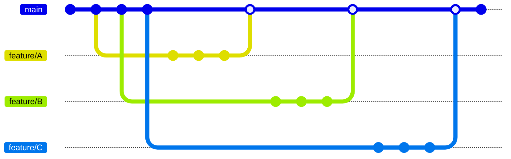
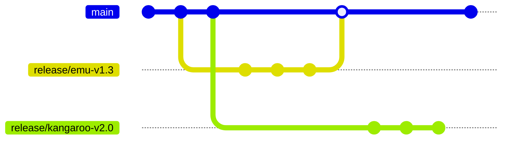
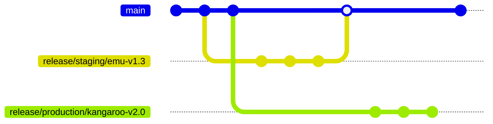

# How I Would Deploy Anything On Kubernetes

In this document, I will do my best to set down my shallow and imprecise opinions on the matter of deploying applications in Kubernetes. I will start from scratch, by taking the example of imaginary HTTP webservers, and detail the full structure of the Git repositories and the folder trees inside them. I will make my best to take into account source code, containerization, deployment, the branching models, release management, versioning of deliverables, what is deployed where, finding what happened when something breaks, applications with sub-components, applications without sources, mono-repos and how it balances with pipeline complexity, scaling to more clusters, and more applications.

This document is licensed under [CC BY-NC-SA 4.0](http://creativecommons.org/licenses/by-nc-sa/4.0/).


## Applications

To start with, I will make up applications: Wombat, Emu, Kangaroo and Platypus. All of them are imaginary, and I imagine them as webapps, that is: programs that spend their lives listening to a network socket for connections, and responding to HTTP(S) requests by HTTP(S) responses.

For each application, I will create one Git repository, [I will expand on mono-repos later on](#containers-and-charts-mono-repos). Each app repo contains the source code of the application, a [Dockerfile](https://docs.docker.com/engine/reference/builder/) for building container images, a [Helm chart](https://helm.sh/) to deploy the application [on the Kubernetes clusters I will make up later](#clusters), and a Jenkinsfile for automation. All applications here are the same, I will show the folder tree for just one repo in order to keep things shorter.

```plaintext
Applications
  🦊 Wombat
  🦊 Emu
  🦊 Kangaroo
  🦊 Platypus
    📁 Sources
      📁 **
        📄 *.{cs,fs,java,kt,py,go,rs} ◄── 1️⃣
    📁 Containers
      🐳 Containerfile ◄── 2️⃣
    📁 Charts
      📦 platypus
        📁 templates
          📄 deployment.yaml
          📄 service.yaml
          📄 service-account.yaml
        📄 Chart.yaml
        📄 values.yaml ◄── 3️⃣
    🔧 Jenkinsfile ◄── 4️⃣
```

Things to consider:

1. Which language(s), librariy(es) and framework(s) you use for developping the applications don't matter at all. The containerization and deployment will differ from one tech stack to another, by that I mean the base image will surely differ, each framework will have expectations regarding the location of the its config files on the file system and environment variables, and will have different capabilities for hot-reloading the configuration without restarting if needs be.

2. Which tool(s) you use to build your container images, be it [Docker](https://docs.docker.com/get-started/overview/), [Podman](https://docs.podman.io/en/latest/), [NerdCTL](https://github.com/containerd/nerdctl), [Kaniko](https://github.com/GoogleContainerTools/kaniko) or anything else, don't matter much either.

3. [Helm VS Kustomize](https://www.youtube.com/watch?v=ZMFYSm0ldQ0&themeRefresh=1)? Here it goes again: this matters as much as a bar fight matters to the world.

   * Raw YAML has the benefit of being the simplest, but will lack refactoring capabilities that go beyond [YAML](https://www.educative.io/blog/advanced-yaml-syntax-cheatsheet#anchors) [Anchors](https://medium.com/@kinghuang/docker-compose-anchors-aliases-extensions-a1e4105d70bd). If your copy-pasting activities are taking an ever larger part of your time table, you should consider upgrading. One red flag that signals the limit of pure YAML is having one big YAML file for all the resources, and abusing YAML Anchors to refactor prevent repetitions. Another potential red flag is using a separate tool to statically generate the YAML.

   * [Kustomize](https://kubectl.docs.kubernetes.io/guides/introduction/kustomize/) works by defining base Kubernetes resources on one side, and overlays for those same resources on the other side. At deploy-time, the overlays form layers that are merged into each other in the configured order. [Kustomize works well for this use case](https://www.densify.com/kubernetes-tools/kustomize/), but lacks the ability to loop over a given list and generate N resources from configuration, or is quite verbose when it comes these advanced modifications. I haven't used it much.

   * [Helm is a template engine](https://helm.sh/docs/chart_template_guide/data_types/). It's like PHP, old PHP without OOP, but you have to open and close the tags on each line, and the indentation of the output matters. On top of that, the user-defined functions, called [Named Templates or Partials](https://helm.sh/docs/chart_template_guide/named_templates/), take only one argument and [can only return strings](https://itnext.io/use-named-templates-like-functions-in-helm-charts-641fbcec38da#67d1). As a software developer by training, the template engine nature of Helm feels the most natural, despite its flaws. Helm shines where Kustomize flickers, lacking the overlaying bit of Kustomize: it is impossible to modify a resource once it's been output from a template file. The solution is to make your template ultra flexile and anticipate by having as many configurable blanks to fill, which leads to the well known [Template Soup](https://news.ycombinator.com/item?id=32624138#:~:text=Without%20you%20adding%20dozens%20of%20lines%20of%20values.yaml%20and%20golang%20template%20soup%20to%20a%20helm%20chart%20to%20allow%20every%20possible%20configuration%20a%20user%20might%20want%20(and%20never%20quite%20the%20same%20way%20in%20two%20different%20helm%20charts%20from%202%20different%20people).) red flag. A Helm chart is only as powerful as its templates are flexible.

   * [Carvel ytt](https://www.youtube.com/watch?v=DLnXkH2keNg), [kpt](https://www.youtube.com/watch?v=Wavigyq7NdQ), [Timoni, CUE](https://www.youtube.com/watch?v=bbE1BFCs548)... At this point, I would advise throwing a fully fledged programming language at it and making your own tool. Use [Typescript](https://www.typescriptlang.org/docs/handbook/typescript-from-scratch.html) with [Bun](https://bun.sh/docs), get built-in support from VS Code, containerize it into an [Argo CD Content Management Plugin](https://argo-cd.readthedocs.io/en/release-2.9/operator-manual/config-management-plugins/), use JS Modules and `export function` to return the Kubernetes resources as objects, gather them into an array, use `for` loops to "overlay" the non-configurable values, serialize to JSON or YAML.

   The important thing here is that the chart only has the default `values.yaml` file. It does not define the values for each cluster or environment the application will be deployed in, as those will be provided by a different source.

4. [Argo Workflows](https://argoproj.github.io/argo-workflows/), [Azure DevOps Pipelines](https://learn.microsoft.com/en-us/azure/devops/pipelines/get-started/what-is-azure-pipelines?view=azure-devops), [Jenkins](https://www.jenkins.io/doc/) or any other pipeline executor(s) that can trigger on change of a Git repository or artifact hub will do, it doesn't matter.

The job of the pipeline in each app repo is to produce deployable deliverables. Namely, it should build the app into a `*.dll`, `*.jar` or whatever artifact applies, run the unit tests, build the container image from the built artifact and publish it to a container registry, update the Helm chart's default `values.yaml` to use this container image, [package](https://helm.sh/docs/helm/helm_package/) it, and push the resulting `*.tgz` to a Helm repository.

This whole application-side sub-process is entirely self-contained, and doesn't require knowledge of where the applications will be deployed. It also heavily relies on you, or an automated process, being disciplined enough to [version the 💩 out of everything](https://semver.org/spec/v2.0.0.html), from application code, to container images, to packaged charts, and cascade the version number increments according to your chosen versioning scheme!


## Clusters

To deploy my imaginary applications, I will make up Kubernetes clusters: Production, Staging and Rolling. Production is obviously live and available from the Internets, while Staging and Rolling are internal. The difference is that you would deploy to Staging to rehearse before deploying to Production, and you would deploy to Rolling much more often, possibly on an automated basis.

For each cluster, I will create one Git repository, [I will expand on mono-repos later on](#clusters-mono-repo). Each cluster repo contains the list of applications to be deployed in the corresponding live cluster, as well as any additional Kubernetes resources, all organized by namespaces and resource types. All clusters here are the same, I will show the folder tree for just one repo in order to keep things shorter.

```plaintext
Applications
  🦊 Wombat
  🦊 Emu
  🦊 Kangaroo
  🦊 Platypus

Clusters
  🦊 Production
  🦊 Staging
  🦊 Rolling
    📁 namespaces
      📁 argo-cd
        📁 argoproj.io.Applications ◄── 1️⃣
          📜 rolling-cluster.yaml
          📜 argo-cd.yaml
          📜 wombat.yaml
          📜 emu.yaml
          📜 kangaroo.yaml
          📜 platypus.yaml
      📁 wildlife ◄── 2️⃣
        📁 bitnami.com.SealedSecret
          📄 emu-omelet.yaml
          📄 kangaroo-pocket.yaml
        📁 networking.k8s.io.Ingresses
          📄 wombat.yaml
          📄 emu.yaml
          📄 kangaroo.yaml
          📄 platypus.yaml
```

Things to consider:

1. Which GitOps agent you install doesn't matter. [OCP ACM](https://www.redhat.com/en/technologies/management/advanced-cluster-management), [Argo CD](https://argo-cd.readthedocs.io/en/stable/) and [Flux CD](https://fluxcd.io/flux/) seem well established in the industry, any tool that works on a K8S Custom Resource to determine what to deploy where, will do.

2. Additional resources include anything that isn't defined in the application Helm charts, such as Secrets, Container Runtime configuration, some people choose not to make Ingresses part of their charts because they draw a line between applications and routing, some do the same for network policies, and the extremists extract Config Maps out of their charts! What matters is minimizing the fear and strain of changes, and keeping together the resources that are tightly coupled, not the means put in place to make this happen.

To bootstrap such a cluster, an operator would first install an Argo CD instance on it, this can be done by templating the official Helm chart, then they would apply the `*-cluster.yaml` [App of Apps](https://argo-cd.readthedocs.io/en/release-2.9/operator-manual/cluster-bootstrapping/#app-of-apps-pattern).

This automates everything else, as the App of Apps references the `namespaces` folder of its own repository, including itself, the `argo-cd.yaml` Argo App, which makes Argo CD deploy and maintain itself, the other Argo Apps, each of which references corresponding business application, and all the other ad-hoc Kubernetes resources defined there!

```plaintext
🦊 Rolling
  📁 namespaces
  ▲ 📁 argo-cd
  │   📁 argoproj.io.Applications
  │     📄 rolling-cluster.yaml
  │       | spec:
  │       |   source:
  │       |     repoURL: https://example.com/git/clusters/rolling.git
  └────── |     path: namespaces
          |     targetRevision: main
        📄 argo-cd.yaml
          | spec:
          |   source:
          |     repoURL: https://example.com/helm
          |     chart: argo-cd # Mirror of the official chart.
          |     targetRevision: 1.2.3
        📄 *.yaml
    📁 **
      📄 *.yaml
```


## Deploying

In this section, I will detail the process of making changes, from app code, container image, deployment chart or configuration, to actual deployment in the clusters. I will consider that a change starts from pushing a commit to the `main` branch, I will explore [more sophisticated branching models later](#branching-models).

1. Whichever Jenkins, ADO or other pipeline executor gets notified of the new commit(s) pushed to `main`. The pipeline rebuilds not only the `*.dll`, but also the container image and the chart! This covers changes to the app code, the `Containerfile` code, and the chart code.

   The pipeline can update and cascade the versions of these aforementioned artifacts automatically, [by inspecting the commit messages](https://medium.com/agoda-engineering/automating-versioning-and-releases-using-semantic-release-6ed355ede742), or use static values provided from the configuration files of the project. The pipeline always publishes new versions of the container image and packaged chart, remember your oath to version the 💩 out of everything!

2. Another pipeline gets notified of the new chart available in the Helm repository. It checks out the Git repo of the Rolling cluster, and updates the `.spec.source.targetRevision` of the appropriate Argo application accordingly.

   This deployment pipeline is separate from the build pipeline that lives in the app repo. I can be defined in the cluster repo, or in an entirely separate repo:

   ```plaintext
   🦊 Automation
     📁 Pipelines
       🔧 Jenkinsfile.auto-deploy-to-rolling
   ```

   The pipeline commits and pushes to he `main` branch of the cluster repo.

3. The GitOps agent installed in the cluster gets notified of the new commit(s) pushed to `main`, and synchronizes the desired state from Git to the cluster. The changes take effect, deployments are modified, Pods are terminated and restarted.

Updating the deployed configuration takes a shorter path, since there is no need to rebuild everything above and including the Helm chart.

1. An operator would change the values of a Config Map, Secret or chart configuration in the cluster repo, commit on the `main` branch, and push.

2. The GitOps agent installed in the cluster gets notified of the new commit(s) pushed to `main`, and synchronizes the desired state from Git to the cluster. The changes take effect immediately.

Promoting a new version of an application to Staging and Production works the same way as in Rolling. The process can be automated, but I want a deploying to Production to be a conscious action for the sake of the example. In this case, it isn't a pipeline, but a human operator who updates the `.spec.source.targetRevision` of the appropriate Argo application. The GitOps agent installed in the cluster will pick up the new commit(s) and do its usual magic.

The strict versioning of everything was worth it: promoting a new version of an application from cluster to cluster is about updating a version number!

It is worth to consider that promotion doesn't apply to the application `*.dll`, not to the container image, these would be red flags, but rather to the entire Helm chart. The rationale behind it is expectation fulfilment: the containerized application has expectations regarding its file system, environment variables, and access to external webservices. The chart packages Kubernetes resources that transform these expectations into Volumes, and Services, and blanks in the templates to be filled by Volume Mounts and other ad-hoc values provided by the cluster-specific configuration. I don't want to be the person fulfilling the new expectations of a new container image using the old resources of an old chart.


--------------------------------------------------------------------------------


## Versioning Discipline

> This section independently builds on top of the original structure of Git repositories, folder tree and process. From there, it details particular points, explores an alternative structure, or incorporates extra constraints.

As glorious as it look, the deployment model I have presented relies heavily on the strict [versioning](https://en.wikipedia.org/wiki/Software_versioning#Schemes) of the application codes, container images, Helm charts. Humans are not disciplined, therefore this raises multiple problems, which in turn have easier or harder solutions:

* It's easy to shoot yourself in the foot, and forget to update the version number of this or that component.
* Where to define the version of each component in the first place?
* Which entity is responsible for updating and cascading the versions?
* When are the versions updated?

Essentially, these boil down to 3 questions: where, when, and who?

### Who

If humans are put in charge of updating and cascading the versions, they might forget tot do so, leading to multiple container images or charts having the same version.

If the pipeline is in charge, it will probably end up [inspecting commit messages to compute the appropriate way to increment the version](https://medium.com/agoda-engineering/automating-versioning-and-releases-using-semantic-release-6ed355ede742) numbers... The same commit messages that were poorly written by humans, leading to misleading version numbers being published.

One possible safeguard is to configure your artifact repository to deny publishing the same artifact with the same version. The pipeline will fail with a lot of pixels turning red, but the versioning scheme will be safe.

Another safeguard is having the build pipeline, or commit hooks, check for version updates. This way, the pipeline will refuse to build or publish anything if it doesn't detect a version update, red pixels everywhere, but it's for the best.

### Where

When actually building, the application build pipeline needs to know where to look for the version number of the application `*.dll`, container image and chart.

* The version of the application code is found in the project manifest file. Whether this is a `*.pom` or a `*.csproj` depends on your tech stack.

* The version of the container image can be stored in a separate file and read by the pipeline.

* The version of the Helm chart is easily found in its `Chart.yaml`.

### When

I thought releasing a new version could be triggered by any push to the `main` branch of the application repo. If there are too many pushes to `main`, it should be possible restrain the releases to trigger only when a tagged commit is pushed to `main`, or only when commits are pushed to `release/*` branches. Refer to the section about [branching models](#branching-models) for more details.


## Different Apps, Different Release Cycles

> This section independently builds on top of the original structure of Git repositories, folder tree and process. From there, it details particular points, explores an alternative structure, or incorporates extra constraints.

The structure I presented is agnostic to changes freezes, and the deployment process is not tightly coupled to the release cycle of any specific application. Which applications are deployed in which clusters is determined entirely by the `.spec.source` of the Argo Apps defined in each cluster. Deploying different application on different release cycles simple means updating different files at different moments, which shouldn't be so difficult.

```plaintext
🦊 Production
  📁 namespaces
    📁 argo-cd
      📁 argoproj.io.Applications
        📜 wombat.yaml   ◄── The
        📜 emu.yaml      ◄── source
        📜 kangaroo.yaml ◄── of
        📜 platypus.yaml ◄── truth
        📜 *.yaml
```


## Nightly Builds

> This section independently builds on top of the original structure of Git repositories, folder tree and process. From there, it details particular points, explores an alternative structure, or incorporates extra constraints.

Do I need nightly builds? No. The latest changes from the `main` branch of each application repo is already automatically built and deployed to the Rolling cluster, I don't need a nightly process to do the same thing again, this wouldn't bring any benefit.

Unless you make so many changes and release so many stable versions of so many applications that the Rolling cluster changes every 10 seconds, you don't need nightly builds. Even then, you are better off finding a solution to throttle your pipeline runs than having nightly builds.


## One Argo CD Instance Per Cluster

> This section independently builds on top of the original structure of Git repositories, folder tree and process. From there, it details particular points, explores an alternative structure, or incorporates extra constraints.

I made the assumption that each cluster would have its own GitOps agent installed inside it, but some teams will prefer to use a separate [Management](https://akuity.io/blog/argo-cd-architectures-explained/) [cluster](https://codefresh.io/blog/a-comprehensive-overview-of-argo-cd-architectures-2023/) to host their GitOps agent, and make it deploy to the other, now remote, clusters. This is perfectly acceptable, but it requires moving a few files around.

```diff
Clusters
  🦊 Management
    📁 namespaces
    ▲ 📁 argo-cd
    │   📁 argoproj.io.Applications ◄── 1️⃣
    │     📁 clusters
    │       🏭 management
    └──────── 📜 management-cluster.yaml
>             📜 argo-cd.yaml
            🏭 production
   ┌───────── 📜 production-cluster.yaml
   │          📜 *.yaml
   │        🏭 staging
   ┌───────── 📜 staging-cluster.yaml
   │          📜 *.yaml
>  │        🏭 rolling
>  │          📜 rolling-cluster.yaml
>  │            | spec:
>  │            |   destination:
>  │            |     name: rolling-cluster
>  │            |   source:
>  │            |     repoURL: https://example.com/git/clusters/rolling.git
>  ┌─────────── |     path: namespaces
>  │            |     targetRevision: main
>  │          📜 wombat.yaml
>  │          📜 emu.yaml
>  │          📜 kangaroo.yaml
>  ▼          📜 platypus.yaml
  🦊 Production
  🦊 Staging
  🦊 Rolling
    📁 namespaces
<   ▲ 📁 argo-cd
<   │   📁 argoproj.io.Applications ◄── 2️⃣
<   └──── 📜 rolling-cluster.yaml
<         📜 argo-cd.yaml
<         📜 wombat.yaml
<         📜 emu.yaml
<         📜 kangaroo.yaml
<         📜 platypus.yaml
      📁 **
        📄 *.yaml
```

1. The management cluster has its own Git repository, which contains the Argo Apps deployed in itself, but also all other clusters, organized nicely with a sub-folder per cluster. In addition, the Argo Apps might need to be renamed to prevent conflicts between the same Argo Apps deployed in different clusters. By default, Argo CD observes its own namespace for Applications resources, but [can be configured to look in other namespaces as well](https://argo-cd.readthedocs.io/en/release-2.9/operator-manual/app-any-namespace/).

   The `.spec.destination.name` of each Argo App will need to be [updated to target the appropriate cluster](https://argo-cd.readthedocs.io/en/release-2.9/operator-manual/declarative-setup/#clusters), otherwise the application will be deployed in the Management cluster!

2. There is no point having the Argo Apps defined and deployed in the remote clusters. There is no Argo CD instance there anymore, those resources will just pile up and take dust.

The benefit of having one Argo CD instance per cluster is that each cluster becomes self-operative, and, most importantly, can be updated independently without the risk of 🍆 up any other cluster of potential higher business value. Argo CD is the GitOps agent, but, thought its Argo App definition, is also just another application.

The benefit of a single Argo CD instance is having a single counter to manage and observe everything. A single URL, a single UI, all the tiles at hand's reach. However, the deployment process presented in this document does not directly action the GitOps agent, relying on its passive state synchronization capabilities instead. If you desire a single UI to observe all your applications, it might be a better option to [wait the implementation of the feature request for the Argo CD Server to support remote instances](https://github.com/argoproj/argo-cd/issues/11498), and deploy [Argo CD Core in each cluster](https://argo-cd.readthedocs.io/en/release-2.9/operator-manual/core/).


## Applications Without Source Code

> This section independently builds on top of the original structure of Git repositories, folder tree and process. From there, it details particular points, explores an alternative structure, or incorporates extra constraints.

Somestimes, as an operator, you will not have access to the source code of the applications you are deploying, nor to the part of real interest: their build pipelines. Whether because your organization is disfunctional or because you are deploying applications that are made by others, you have to consider them as External Applications and treat them appropriately.

Depending on how much external an application is, there are always ways.

* If the developers publish the `*.dll` for their application, your build pipeline will have to be triggered by some kind of webhook or other event that happens whenever new artifacts are pushed to an external registry. From there, the pipeline can build the container image and the Helm chart normally.

* If the developers publish a container image, your pipleline can be triggered by the events of their container registry, and package the Helm chart normally. If you don't like the stock version of a container image, you can make your own image using the stock image as a base. In this case, a human can consciously update the base version, or this task can be left to the pipeline.

* If the developers publish a Helm chart, you can point the Argo Applications to their Helm repository directly, this is what I've been doing for Argo CD itself, or extend the stock chart by wrapping it an Umbrella Chart. Similar to the container image, either a human or an automated pipeline can update the version of the dependency chart.

Using the container base image and the chart dependencies, you can end up with two pairs of contaimer image and chart for one application.


## Branching Models

> This section independently builds on top of the original structure of Git repositories, folder tree and process. From there, it details particular points, explores an alternative structure, or incorporates extra constraints.

In this section, I will explain the details of the Git branching models I would use for both the application repositories and the cluster repositories.

### For Applications

[Real [men] commit on the `main` branch](https://www.youtube.com/watch?v=hL1OZfgoZGk) directly. This is virile and removes the need for a branching model and the associated headaches. The downside of this non-model appears when one developer gets stuck on a feature: they get stuck on `main`, there is no build anymore, they stick everybody else with them.

The conservative rest of the population will appreciate the ability to buffer changes on `feature/*` branches before merging to `main`.



When to build releases?

* Option A: for each push to `main`.

  ```mermaid
  %%{
    init: {
      'gitGraph': {
        'showCommitLabel': false
      }
    }
  }%%
  gitGraph
    commit

    commit
    branch feature/A
      checkout main

    commit
    branch feature/B
      checkout main

    commit tag: "→ 1.2.3"
    branch feature/C
      checkout main

    checkout feature/A
      commit
      commit
      commit
      checkout main
      merge feature/A tag: "→ 1.3.0"

    checkout feature/B
      commit
      commit
      commit
      checkout main
      merge feature/B tag: "→ 2.0.0"

    checkout feature/C
      commit
      commit
      commit
      checkout main
      merge feature/C tag: "→ 2.0.1"

    commit
  ```

  This means that some effort must be made to keep the state of the `main` branch as stabe as possible, because whatever is in `main` is considered as potentially deployable to production. If `main` doesn't systematically produce stable deliverables, the pressure is passed onto the pipeline, which has the heavy responsibility to fail fast, therefore aborting the release altogether.

  To mitigate this while still considering `main` as the sole source of publication, changes, which are already buffered on `feature/*` branches, can be buffered again on a `dev` branch before a final merge to `main`. In addition, merging to `dev` can trigger the build of Preview or Snapshot releases.

  ```mermaid
  %%{
    init: {
      'gitGraph': {
        'showCommitLabel': false
      }
    }
  }%%
  gitGraph
    commit tag: "→ 1.2.3"

    branch dev
    commit

    commit
    branch feature/A
      checkout dev

    commit
    branch feature/B
      checkout dev

    commit
    branch feature/C
      checkout dev

    checkout feature/A
      commit
      commit
      commit
      checkout dev
      merge feature/A tag: "→ 1.3.0-preview1"

    checkout feature/B
      commit
      commit
      commit
      checkout dev
      merge feature/B tag: "→ 2.0.0-preview1"

    checkout main
      merge dev tag: "→ 2.0.0"

    checkout feature/C
      commit
      commit
      commit
      checkout dev
      merge feature/C tag: "→ 2.0.1-preview1"

    checkout main
      merge dev tag: "→ 2.0.1"

    commit
  ```

* Option B: for each tagged commit pushed to `main`, this way, there is more control on when the build pipeline runs.

  ```mermaid
  %%{
    init: {
      'gitGraph': {
        'showCommitLabel': false
      }
    }
  }%%
  gitGraph
    commit

    commit
    branch feature/A
      checkout main

    commit
    branch feature/B
      checkout main

    commit tag: "v1.2.3 → 1.2.3"
    branch feature/C
      checkout main

    checkout feature/A
      commit
      commit
      commit
      checkout main
      merge feature/A tag: "→ no build"

    checkout feature/B
      commit
      commit
      commit
      checkout main
      merge feature/B tag: "→ no build"

    checkout feature/C
      commit
      commit
      commit
      checkout main
      merge feature/C tag: "v2.0.0 → 2.0.0"

    commit
  ```

* Option C: for each commit pushed to any `release/*` branch. Thee `release/*` branches live forever, they are never merged back. This model is especially useful when supporting multiple versions of the application in parallel.

  ```mermaid
  %%{
    init: {
      'gitGraph': {
        'showCommitLabel': false,
        'mainBranchOrder': 10
      }
    }
  }%%
  gitGraph
    commit

    commit
    branch feature/A order: 11
      checkout main

    commit
    branch feature/B order: 11
      checkout main

    commit
    branch feature/C order: 11
      checkout main

    checkout feature/A
      commit
      commit
      commit
      checkout main
      merge feature/A

    branch release/v1.3 order: 0
      commit tag: "→ 1.3.0"
      commit
      branch hotfix/A
        commit
        commit id: "cherry"
    checkout release/v1.3
      merge hotfix/A tag: "→ 1.3.1"
      commit

    checkout main
      cherry-pick id: "cherry" tag: ""

    checkout feature/B
      commit
      commit
      commit
      checkout main
      merge feature/B

    checkout feature/C
      commit
      commit
      commit
      checkout main
      merge feature/C

    branch release/v2.0 order: 1
      commit tag: "→ 2.0.0"
      commit
      branch hotfix/B order: 1
        commit
        commit
      checkout release/v2.0
      merge hotfix/B tag: "→ 2.0.1"
      commit

    checkout main
    commit
  ```

* Option D: for each tagged commit pushed to any `release/*` branch. I think you get the picture.

The branching model for the application repository encompasses the source code, but also the container manifest and the chart code, as those three deliverables are tightly coupled. I will leave the headache of choosing which of the application artifact, container image or Helm chart should give its version number to the release tags and branches to the reader an an exercise.

### For Clusters

The branching model for the cluster repositories can be simpler. After all, the Kubernetes resources defined in these repos are to be deployed and synchronized continuously with the cluster. In these conditions, there are no versions beyond the ones set by the Git commits, there is only one timeline, the timeline in which the cluster lives in, our timeline, the `main` timeline.


At this point, you may make a change in the Rolling or Staging cluster and think you will need it in the Production cluster as well... But not now... But you will forget if you delay the change... This situation calls for `release/*` branches.

Don't be fooled by the naming: the `release/*` branches of the cluster repositories have nothing to do with the `release/*` branches of the application repositories. They are more alike their `feature/*` branches, in that they are here to buffer changes before merging to the `main` branch.



In cluster repositories, hotfixes can be implemented directly on `main`. The GitOps agent will synchronize the changes automatically.


## Applications With Multiple Components

> This section independently builds on top of the original structure of Git repositories, folder tree and process. From there, it details particular points, explores an alternative structure, or incorporates extra constraints.

Applications range from simple mono microservice HTTP APIs to interconnected Krakens. In this section I will explore splitting the Platypus application into 3 webservices: Duck, Bear and Beaver.

The easiest option is to keep splitting the application repo into Source, Containers and Charts first, then splits again into each component. There is one chart that generates Kubernetes resources for the 3 components.

```plaintext
🦊 Platypus
  📁 Sources
    📁 Duck
      📁 **
        📄 *.{cs,fs,java,kt,py,go,rs}
    📁 Bear
      📁 **
        📄 *.{cs,fs,java,kt,py,go,rs}
    📁 Beaver
      📁 **
        📄 *.{cs,fs,java,kt,py,go,rs}
  📁 Containers
    🐳 Containerfile.duck
    🐳 Containerfile.bear
    🐳 Containerfile.beaver
  📁 Charts
    📦 platypus
      📁 templates
        📁 duck
          📄 *.yaml
        📁 bear
          📄 *.yaml
        📁 beaver
          📄 *.yaml
      📄 Chart.yaml
      📄 values.yaml
  🔧 Jenkinsfile
```

The major issue is that there are now 3 components for a single pipeline, which must now build 3 applications and 3 container images. This means building all 3 components everytime, or increase the complexity of the pipeline to detect which component(s) have been changed. There is only one chart, which makes for a single `appVersion` field in `Chart.yaml`, and the choice of which version to pick if the components are versioned separately.

Having the same version for all the components and systematically building them together makes the most sense here.

The closest evolution is to split the chart into 4: one for each component and one umbrella chart, referencing the components using the Helm dependency mechanism.

```plaintext
🦊 Platypus
  📁 Sources
  📁 Containers
  📁 Charts
┌─► 📦 duck
│     📁 templates
│       📄 *.yaml
│     📄 Chart.yaml
│     📄 values.yaml
┌─► 📦 bear
│     📁 templates
│       📄 *.yaml
│     📄 Chart.yaml
│     📄 values.yaml
┌─► 📦 beaver
│     📁 templates
│       📄 *.yaml
│     📄 Chart.yaml
│     📄 values.yaml
│   📦 platypus
└──── 📄 Chart.yaml
  🔧 Jenkinsfile
```

Alternatively, put the component charts in `Charts/platypus/charts`.

The final form of the component split puts each component in its own application repository, each containing its own source code, container manifest, Helm chart and pipeline, and functioning independently. The Platypus application repository now doesn't hold any source code nor container manifest anymore, and consists solely of an umbrella chart and the pipeline to package it, triggered by the push of one of its dependencies to the Helm repository.

```plaintext
🦊 Duck
🦊 Bear
🦊 Beaver
▲ 📁 Sources
│   📁 **
│     📄 *.{cs,fs,java,kt,py,go,rs}
│ 📁 Containers
│   🐳 Containerfile
│ 📁 Charts
┌─► 📦 beaver
│     📁 templates
│       📄 *.yaml
│     📄 Chart.yaml
│     📄 values.yaml
│ 🔧 Jenkinsfile
│
│ 🦊 Platypus
│   📁 Charts
│     📦 platypus
└────── 📄 Chart.yaml
    🔧 Jenkinsfile
```


## Clusters Mono Repo

> This section independently builds on top of the original structure of Git repositories, folder tree and process. From there, it details particular points, explores an alternative structure, or incorporates extra constraints.

In this section, I will weigh the pros and cons of merging all the cluster repositories into one. The change to the folder tree and the Argo Apps is minimal, as each cluster, which was previously in its own repository, is now a sub-folder in the Clusters mono repo.

```plaintext
🦊 Clusters
  🏭 Production
  🏭 Staging
  🏭 Rolling
┌─► 📁 namespaces
│   📁 argo-cd
│     📁 argoproj.io.Applications
└────── 📜 rolling-cluster.yaml
        📜 argo-cd.yaml
        📜 wombat.yaml
        📜 emu.yaml
        📜 kangaroo.yaml
        📜 platypus.yaml
      📁 wildlife
        📁 bitnami.com.SealedSecret
          📄 emu-omelet.yaml
          📄 kangaroo-pocket.yaml
        📁 networking.k8s.io.Ingresses
          📄 wombat.yaml
          📄 emu.yaml
          📄 kangaroo.yaml
          📄 platypus.yaml
```

You could imagine splitting the mono repo by resource type first, and cluster second, but you would need to define an Argo App for each cluster sub-folder, leading to the explosion of the Argo App population for little benefit.

```diff
🦊 Deployments
  📁 argoproj.io.Applications
    🏭 Production
    🏭 Staging
┌─► 🏭 Rolling
│     📁 argo-cd
└────── 📜 rolling-cluster-applications.yaml
┌────── 📜 rolling-cluster-sealed-secrets.yaml
┌────── 📜 rolling-cluster-ingresses.yaml
│       📜 argo-cd.yaml
│       📜 wombat.yaml
│       📜 emu.yaml
│       📜 kangaroo.yaml
│       📜 platypus.yaml
│ 📁 bitnami.com.SealedSecret
│   🏭 Production
│   🏭 Staging
└─► 🏭 Rolling
│     📁 wildlife
│       📄 emu-omelet.yaml
│       📄 kangaroo-pocket.yaml
│ 📁 networking.k8s.io.Ingresses
│   🏭 Production
│   🏭 Staging
└─► 🏭 Rolling
      📁 wildlife
        📄 wombat.yaml
        📄 emu.yaml
        📄 kangaroo.yaml
        📄 platypus.yaml
```

The difference of merging the clusters into a mono repo is felt most on the branching model. There is still only one `main` timeline, therefore the GitOps agent of each cluster will still observe a sub-folder of the Clusters repo on the `main` branch. The process for making changes here is not perturbated. However, release branches are created at the repository level, and need special naming care to distinguish between upcoming releases to Staging and upcoming releases to Production.



A Clusters mono repo makes it easier to make changes to multiple clusters at once, has minimal effects on the folder tree and the branching model, and may make checking out the repo slightly slower for the GitOps agents, due to it holding resources for all the clusters.


## Containers And Charts Mono Repos

> This section independently builds on top of the original structure of Git repositories, folder tree and process. From there, it details particular points, explores an alternative structure, or incorporates extra constraints.

In this section, I will weigh the pros and cons of merging all the `Containers` and `Charts` sub-folders of the application repositories into one. The change to the folder tree and the structure of the Git repositories is quite drastic, as all the container manifests are moved into a single Containers mono repo, and all the Helm charts are moved into a Charts mono repo. Each mono repo has its own pipeline to builds the container images or the Helm charts.

```plaintext
🦊 Containers
  🐳 Containerfile.wombat
  🐳 Containerfile.emu
  🐳 Containerfile.kangaroo
  🐳 Containerfile.platypus
  🔧 Jenkinsfile

🦊 Charts
  📦 wombat
  📦 emu
  📦 kangaroo
  📦 platypus
    📁 templates
      📄 deployment.yaml
      📄 service.yaml
      📄 service-account.yaml
    📄 Chart.yaml
    📄 values.yaml
  🔧 Jenkinsfile
```

Splitting the Git repositories by layers instead of by silos makes a big difference to the pipelines. If the pipeline of each application repo was building a single container image and chart unconditionally, it is no longer acceptable to rebuild all the images on the slightest change. This adds complexity to the mono pipelines in order to compute which container images and charts have to be rebuilt. Refactoring the pipeline with a loop makes it more rigid, but reduces duplication to the point that it is possible to add more container images and charts with zero pipeline code maintenance cost! This also means that cloning the mono repo on each pipeline run will be slower as new applications pile up.

Having all container manifests or charts in a single repo makes it easier to change multiple of them in one go. The branching model is also impacted: you have to catter for the fact that the branches now cover all the container images or charts. In practice, it feels wrong to separate bricks that are so tightly coupled. The majority of changes will span a single chart, or a container image and its deploying chart. You will end up making changes to 2 branches in 2 repositories.

If you want to reduce duplication in the pipeline code, you may want to refactor some funtions in a plugin for your pipeline executor, or extract the process into a separate build pipeline that can be triggered from any application repo.


## Scaling To More Applications

> This section independently builds on top of the original structure of Git repositories, folder tree and process. From there, it details particular points, explores an alternative structure, or incorporates extra constraints.

Adding more applications to the infrastructure consists in adding a new application repository, containing the sources, containerfiles, Helm charts and build pipeline. To deploy the new application to any cluster, add a new Argo app manifest to the appropriate cluster(s).


<!--
todo
  ubiquitous language => glossary
    app code
    app
    argo app
    gitops agent
    container
    container image
    containerfile
    deployment package/chart
    pipeline executor
    application repository
    cluster repository
    artifact
    build
    publish
    push
    container registry
    helm repository
    containers mono repo
    charts mono repo
    umbrella chart
  spelling
  phrasing consolidation
  links!
  more sections
    What is deployed where
    Something broke, find what happened
    Dev
      no local because 👿 VPN blocks `docker pull`
    Scaling to more clusters
      Production 2
      Refactor SCCs
      Refactor Apps
    where are the charts values

-->
